# Интернет-магазин (Django + React)

Учебный проект интернет-магазина: каталог товаров, корзина, заказы с контролем
остатков, роли пользователей и уведомления.

## Технологии

**Backend:** Python, Django, Django REST Framework, PostgreSQL, Simple JWT,
django-filter, drf-spectacular.
**Frontend:** React, TypeScript, Vite, React Router, TanStack Query, React Hook Form.
**Инфраструктура:** Docker, Docker Compose.

## Структура

```
shop/
  backend/      # Django-приложение (config + apps: users, catalog, orders, notifications)
  frontend/     # React-приложение (Vite)
  docker-compose.yml
```

## Запуск

1. Скопируй файл окружения:
   ```bash
   cp backend/.env.example backend/.env
   ```
2. Собери и запусти проект:
   ```bash
   docker compose up --build
   ```
3. В **другом терминале** загрузи демо-данные
   (товары и тестовые аккаунты):
   ```bash
   docker compose exec backend python manage.py seed_demo
   ```
   Миграции применяются автоматически при старте backend-контейнера.

После запуска доступно:
- Frontend — http://localhost:5173/
- Backend API — http://localhost:8000/api/
- Swagger UI — http://localhost:8000/api/docs/
- Django Admin — http://localhost:8000/admin/

## Тестовые аккаунты

| Email | Пароль | Роль |
|---|---|---|
| admin@shop.com | cjif34f8y57gjtn | ADMIN |
| manager@shop.com | cjif34f8y57gjtn | MANAGER |
| anjik14.01@gmail.com | cjif34f8y57gjtn | USER |

## Тесты

```bash
docker compose exec backend python manage.py test apps.users.tests apps.catalog.tests apps.orders.tests
```

Результат: `Ran 8 tests ... OK` — покрыты регистрация, вход, права на товары,
создание заказа, запрет заказа сверх остатка, списание и возврат остатка,
доступ к чужому заказу.

## Скриншоты

### Аутентификация
| Регистрация | Вход |
|---|---|
| 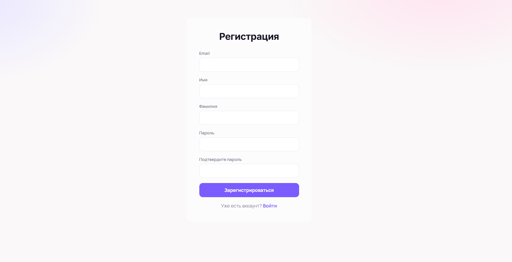 | 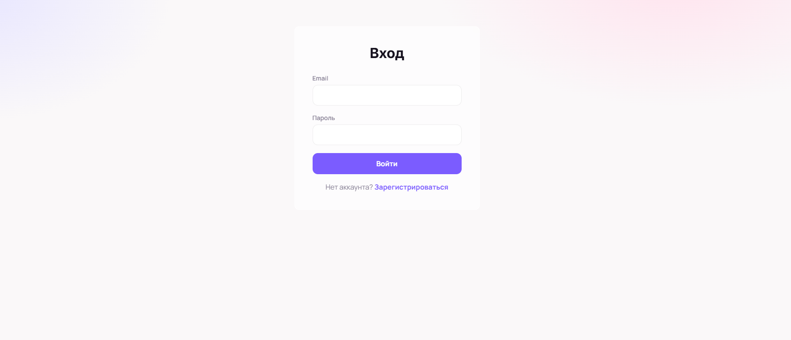 |

### Покупатель
| Каталог | Страница товара |
|---|---|
| 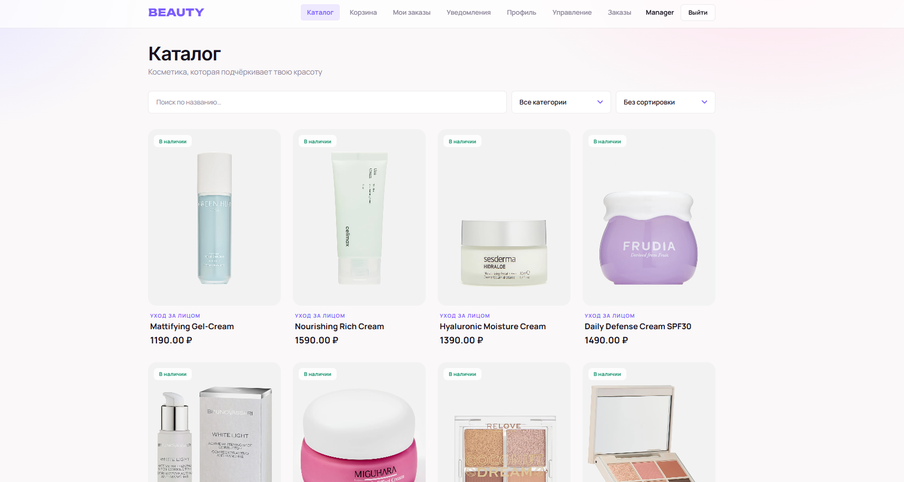 | 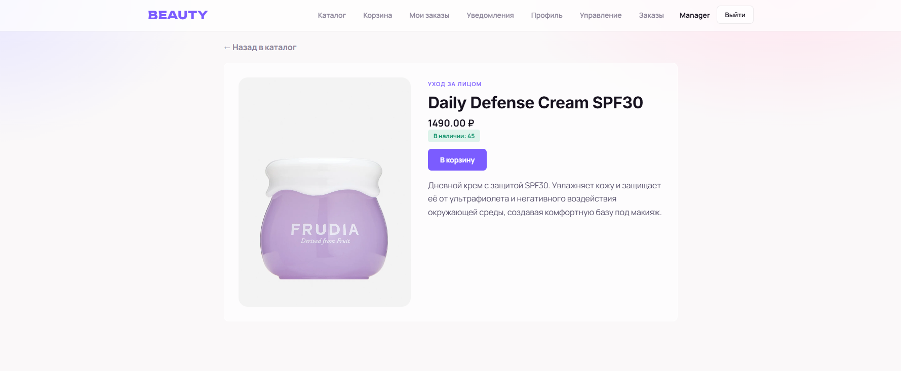 |

| Корзина | Оформленные заказы |
|---|---|
| 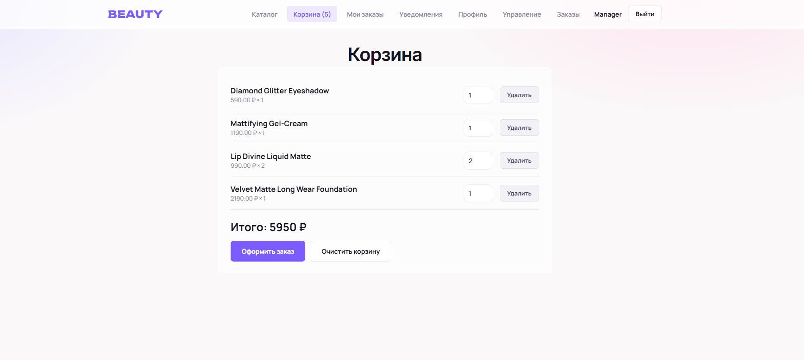 | 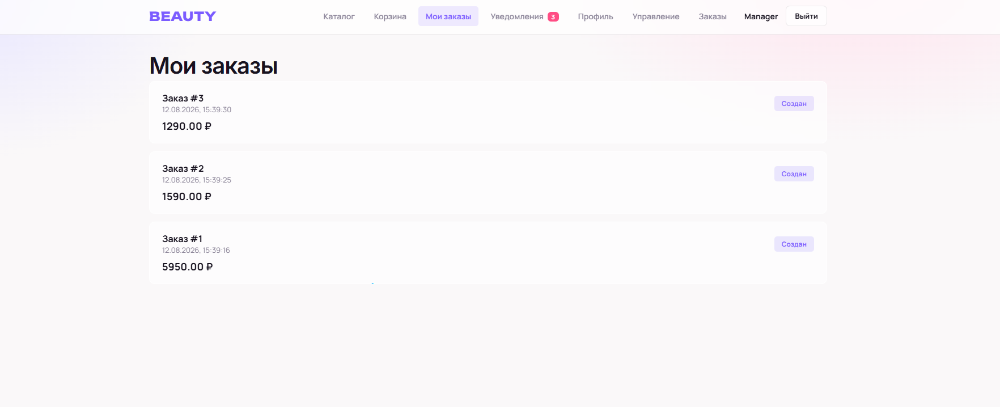 |

| Детали заказа | Профиль |
|---|---|
| 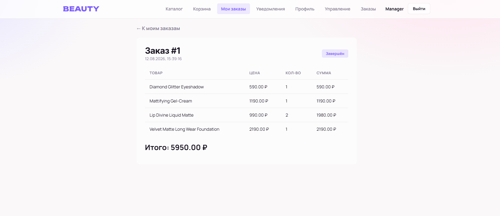 | 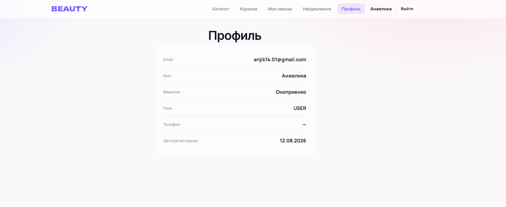 |

| Уведомления | |
|---|---|
| 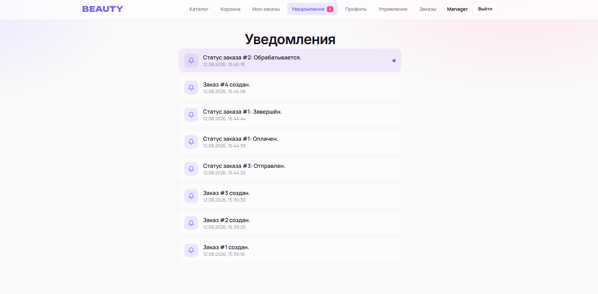 | |

### Менеджер
| Управление товарами | Форма товара |
|---|---|
| 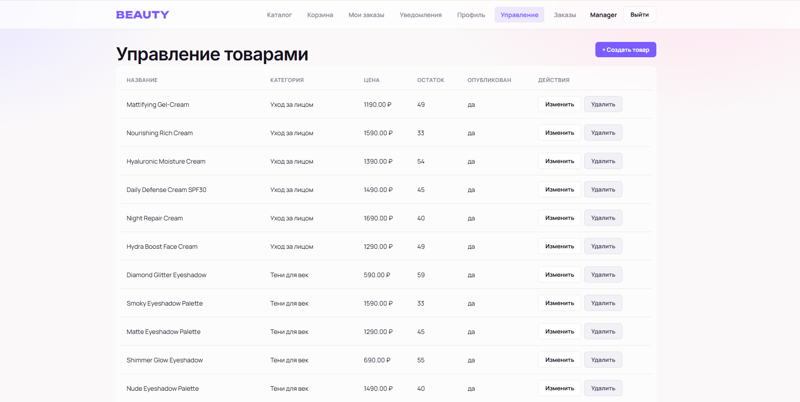 | 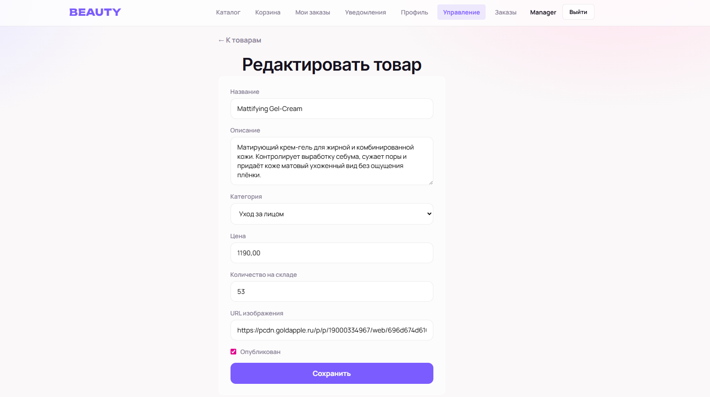 |

| Управление заказами | |
|---|---|
| 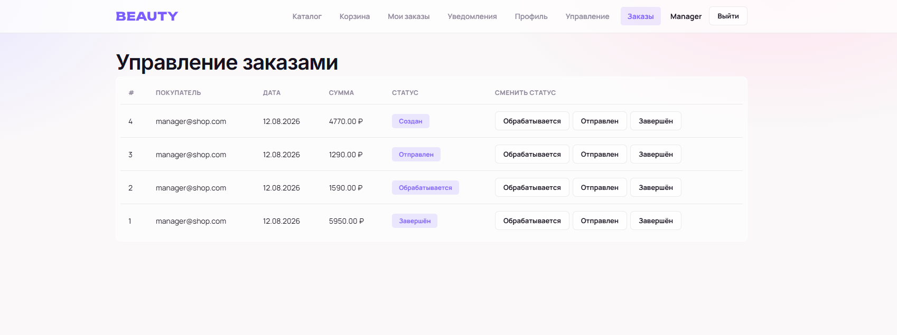 | |


## Реализованная функциональность

- Регистрация, вход по JWT, профиль пользователя.
- Каталог: поиск, фильтры (категория, цена, наличие), сортировка.
- Управление товарами для менеджера.
- Корзина (хранится в localStorage).
- Заказы: создание в транзакции с проверкой и списанием остатка,
  оплата, отмена с возвратом остатка, смена статуса менеджером.
- Уведомления при создании заказа и смене статуса.
- Роли USER / MANAGER / ADMIN с проверкой прав на backend.

## Известные ограничения

- Корзина хранится только на frontend (localStorage).
- Платёжная система не подключена (оплата — смена статуса).
- Email-уведомления не отправляются (только в базе).